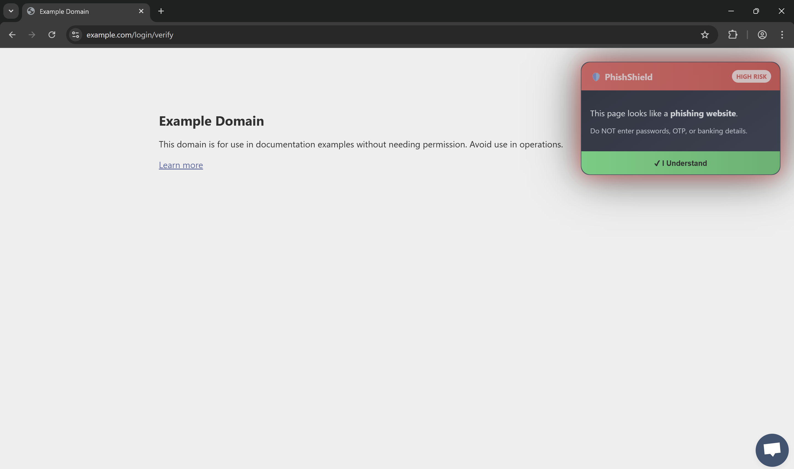
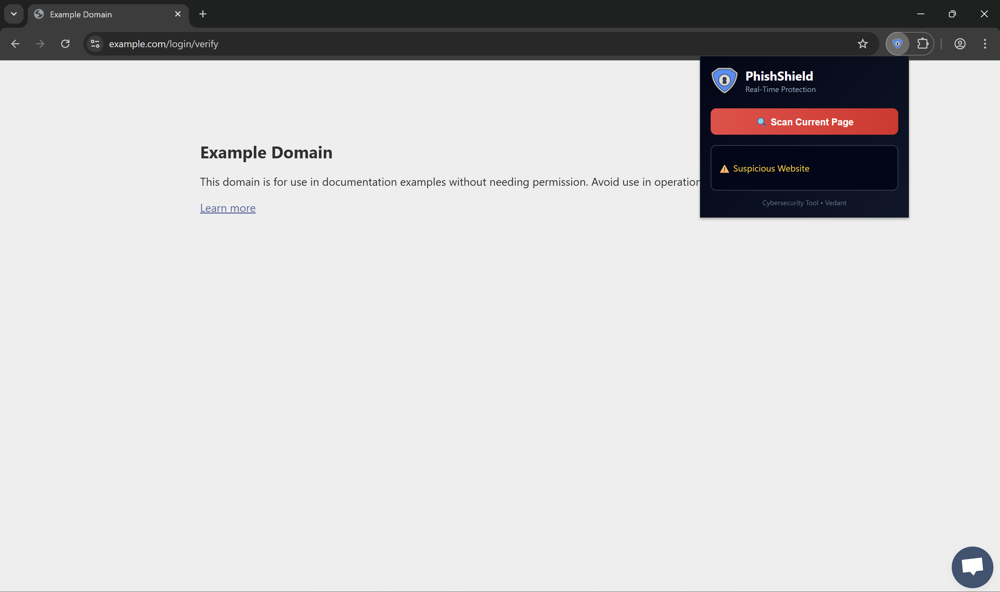

# 🛡️ PhishShield – Real-Time Phishing Detection Extension

## 👨‍💻 Author
**Vedant**  
Manipal University Jaipur  
---

## 📌 Project Overview
PhishShield is a browser extension that detects phishing websites in real-time and warns users before they interact with malicious content.

With the rapid rise of AI-generated phishing attacks, traditional security methods are not always sufficient. This extension helps users stay safe by identifying suspicious URLs and displaying clear visual warnings.

---

## 🚀 Features

- 🔍 Real-time URL analysis
- ⚠️ Instant phishing warning alerts
- 🛡️ Custom modern UI security popup
- 📊 Keyword-based phishing detection engine
- 🧠 Behavioral pattern detection (login, verify, bank, etc.)
- 📁 Dataset for phishing and legitimate URLs
- 📸 Screenshot demonstration included

---

## 🛠️ Tech Stack

- **JavaScript** (Core Logic)
- **HTML & CSS** (User Interface)
- **Chrome Extension API**
- **GitHub** (Version Control & Deployment)

---

## 📊 Detection Method

The extension uses a **rule-based detection model**:

- Scans the current URL
- Checks for suspicious keywords such as:
  - `login`
  - `verify`
  - `bank`
  - `secure`
  - `free`
  - `gift`
  - `confirm`
- Calculates a risk score
- Displays a warning UI if the score exceeds threshold

## 🌐 Real-Time Threat Detection

PhishShield integrates with the **Google Safe Browsing API** to detect known malicious and phishing URLs in real time.

This provides cloud-based threat intelligence along with local rule-based detection.

## 📸 Demo Screenshots

### 🔴 Phishing Warning UI

### 🔍 Popup Scanner

---